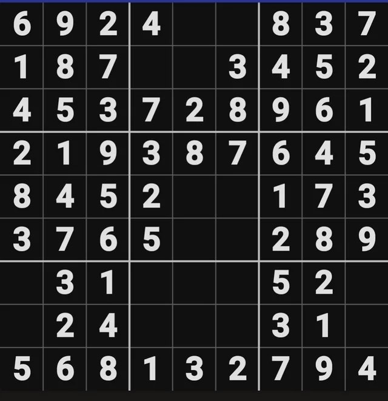
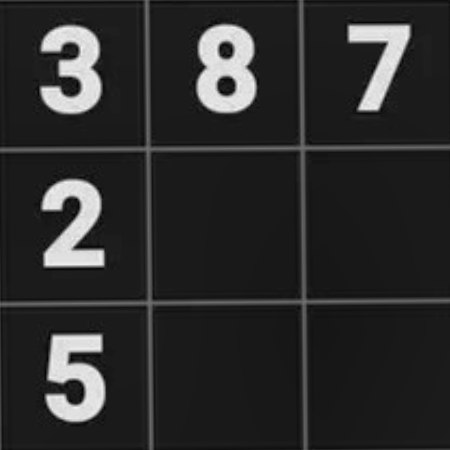
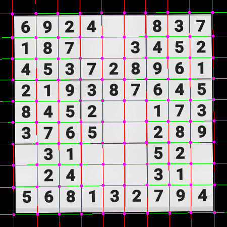
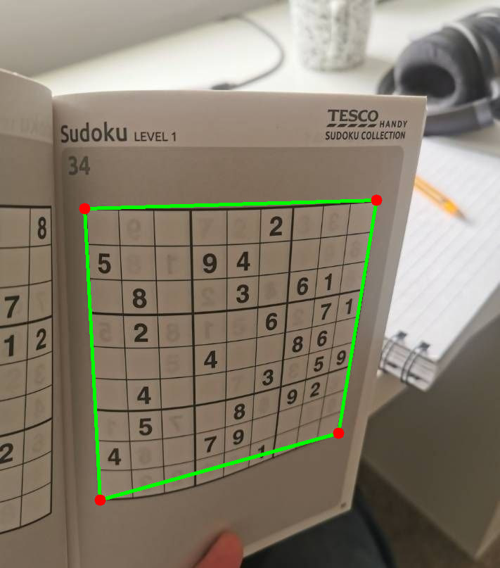
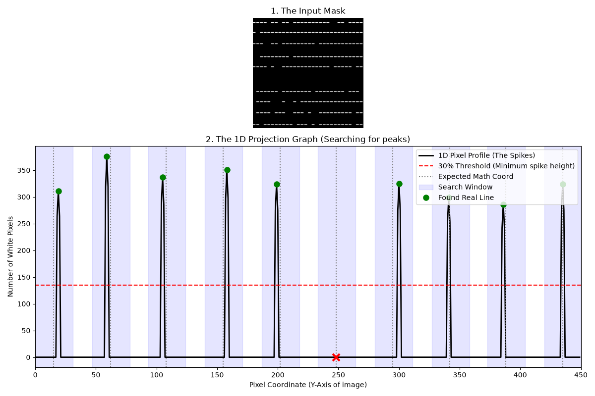
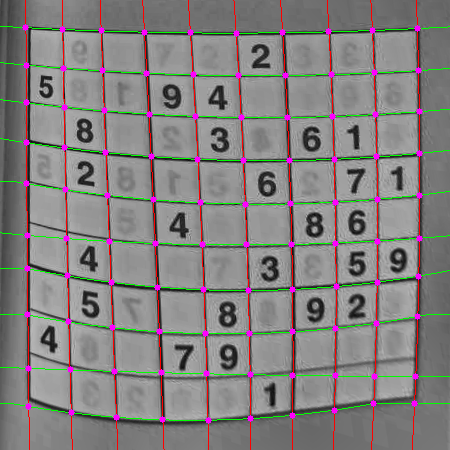

# Estalakh — Sudoku Solver from a Photo

Point a camera at a Sudoku puzzle — printed, English or Persian digits, at
any rotation, on a flat or curved/folded page — and get the solved grid
back overlaid on the original photo.

<p align="center">
   grayscale + polarity fix -> adaptive threshold -> corner detection -> corner ordering -> corner refinement -> perspective warp -> grid-line removal -> curve tracing -> 81 cells -> output" width="420">
</p>

## How it works

```
photo -> grid detection & perspective warp -> 81 cell crops
      -> orientation + language auto-detection (voted by the recognition model itself)
      -> digit recognition (EfficientNet-B1, ONNX Runtime)
      -> backtracking solver -> solution rendered back onto the photo
```

- **Grid extraction** (`src/grid_extraction.py`) locates the grid through a
  three-tier fallback (contour → relaxed min-area-rect → Hough lines),
  perspective-warps it to a fixed canvas, and — for curved or photographed
  book pages — traces each of the 20 grid lines as a curve and cuts all 81
  cells with individual homographies instead of one uniform grid.
- **Digit recognition** (`src/recognition/`) is EfficientNet-B1, fine-tuned
  separately for English and Persian digits directly on the *output of the
  extraction pipeline* (not a generic digit dataset) — closing the
  train/serve gap is what actually made this work.
- **Orientation & language** are resolved together at inference time: all 4
  rotations are tried for both languages, and whichever combination the
  recognition model reads with the highest average confidence wins.
- **ONNX Runtime** serves the recognition models (~13ms/cell vs. ~410ms/cell
  in eager PyTorch) — about 30-35x faster, which is what makes classifying
  up to 81 cells per request viable inside a synchronous HTTP call.

## Getting started

Requires Python 3.12+ and [`uv`](https://docs.astral.sh/uv/).

```bash
uv sync
uv run uvicorn src.api.app:app --reload
```

Open `http://localhost:8000/` — the API serves the web UI directly.

Recognition uses ONNX weights by default (`src/models/*.onnx`, checked into
the repo alongside the app). Model checkpoints and datasets used for
*training* are gitignored; see [Training your own models](#training-your-own-models).

## API

| Endpoint         | Method | Description                                                                |
| ---------------- | ------ | --------------------------------------------------------------------------- |
| `/`              | GET    | Web UI                                                                       |
| `/health`        | GET    | Liveness check                                                               |
| `/predict/cell`  | POST   | Classify a single cropped digit image                                       |
| `/solve`         | POST   | Full pipeline: upload a puzzle photo, get grid + solution + overlay image   |

`/solve` accepts `?debug=true` (dumps intermediate crops to `out/solve/`)
and `?stages=true` (returns base64-encoded intermediate pipeline images —
handy for reproducing the diagrams below on your own photos).

## Under the hood

The interesting parts of this project are the failure modes that a "happy
path" grid extractor and a generic digit classifier run into on real phone
photos, and what it took to fix each one. Details below are trimmed from a
much longer internal write-up ([`docs/project-document.md`](docs/project-document.md),
in Persian) — this section is the English summary with the supporting
diagrams.

### Finding the grid: a three-tier fallback

`_locate_grid` tries, in order: (1) the largest external contour reduced to
a convex quad via `approxPolyDP`, (2) if the outer border is fainter than
the inner 3×3 box dividers and never reduces to a clean quad, its
min-area bounding rect, (3) `HoughLines` intersected by angle as a last
resort. Once a quad is found, corners need a fixed order (top-left,
top-right, bottom-right, bottom-left) regardless of how the contour walked
them — solved with a simple invariant (assuming rotation under 45°): the
top-left corner minimizes `x+y`, the bottom-right maximizes it; the
top-right minimizes `y-x`, the bottom-left maximizes it.

<p align="center">
  
</p>

The first pass of corners is usually a few pixels off. A second pass warps
the image with the rough corners, re-detects grid lines on the now
axis-aligned result (much cleaner than on the raw perspective photo), and
maps the refined quad back through the inverse of the first warp:

<p align="center">
  
</p>

### Grid flush against the frame edge

If the grid touches the edge of the photo with no margin, its outer
contour never closes, and detection can lock onto an inner 3×3 block
instead of the whole grid:

<p align="center">
  
  &nbsp;&nbsp;
  
</p>

Fix: pad the binary image with `copyMakeBorder` before contour search (and
subtract the pad back out of the returned coordinates), so a closed contour
always exists even when the grid reaches the frame boundary:

<p align="center">
  
</p>

### Curved and folded pages

A homography models a flat plane. On a curved book page, the 4 outer
corners still map correctly, but the lines *between* them stay curved —
a uniform 9×9 split drifts away from the real cell boundaries toward the
middle of the grid:

<p align="center">
  
</p>

Instead of assuming straight lines, each of the 20 grid lines is traced as
its own curve (dilate across the line's own direction so a thickened curved
line still contains a straight sub-segment for morphological opening to
survive, then take the per-column pixel centroid and fit a quadratic):

<p align="center">
  
</p>

Grid-line *positions* (used both for the uniform-split fallback and as the
search window for curve tracing) come from summing the line mask along the
axis perpendicular to each line — real grid lines show up as sharp peaks
against the background:

<p align="center">
  
</p>

The 10 horizontal and 10 vertical curves intersect at 100 nodes, which
group into 81 quads — each cell is then cut with its own homography instead
of a shared uniform grid:

<p align="center">
  
</p>

If fewer than 8 of the 20 lines can be traced confidently, the pipeline
falls back to the uniform split rather than trusting a noisy curve fit.

### Digit recognition: matching training data to what the pipeline actually produces

Both digit classifiers (English and Persian) share one architecture —
EfficientNet-B1 pretrained on ImageNet with a custom head
(`Dropout(0.3) → Linear(1280,512) → Dropout(0.2) → Linear(512,10)`, 10
classes: 0 = empty cell, 1-9 = digit) — defined once in
`src/recognition/model.py`. Getting the *training data* right took three
attempts for English:

1. **Chars74K "Fnt"** (synthetic typed-font characters) — didn't generalize.
   Clean, evenly-lit, tightly-cropped glyphs look nothing like our
   extraction pipeline's real crops (noise, uneven lighting, imperfect
   binarization, crop artifacts).
2. **MNIST** (handwritten digits) — better, still not enough, same root
   cause: MNIST digits are centered/denoised/normalized in a way our real
   crops aren't.
3. **Fine-tune directly on the extraction pipeline's own output** (final,
   production approach) — run a labeled Sudoku photo dataset
   ([`mexwell/sudoku-image-dataset`](https://www.kaggle.com/datasets/mexwell/sudoku-image-dataset)
   on Kaggle) through `src/grid_extraction.py` itself, pair each of the 81
   resulting cell crops with its ground-truth label, and fine-tune on
   *that*. This closes the train/serve gap completely, since the training
   images are produced by the exact same pipeline the model sees at
   inference time. `scripts/build_finetune_dataset.py` builds this dataset;
   `src/recognition/train.py` trains on it.

There's no ready-made "Persian Sudoku" dataset, so the Persian model
followed the same lesson via a different route: a synthetic-data generator
(`scripts/persian_digit_dataset.py`) lays out a random 9×9 grid, renders
Persian digits with a real font (`scripts/Yekan.ttf`), warps the clean
puzzle onto a random perspective, and applies random degradations
(rotation/scale jitter, low light, Gaussian noise, blur, directional shadow
gradients) to imitate a real photo. Those synthetic images are then run
through the *same* `grid_extraction.py` pipeline
(`scripts/build_persian_finetune_dataset.py`) to produce the actual
fine-tuning dataset — again matching the training distribution to the
served distribution rather than to a generic "clean digits" dataset.

Both models follow the same two-stage fine-tuning recipe (based on the
[transfer learning & fine-tuning guide](https://www.tensorflow.org/tutorials/images/transfer_learning),
adapted for PyTorch): BatchNorm layers are forced to `.eval()` throughout
(never updating their running stats on the small fine-tuning set), the
classifier head trains alone for a few epochs with the backbone frozen,
then the last backbone block unfreezes for a low-learning-rate fine-tune
pass, keeping the best checkpoint by validation accuracy.

### Orientation & language: voted, not classified directly

A photo may arrive rotated 0/90/180/270° and be either an English or
Persian puzzle. Both are resolved by the same trick, in
`src/orientation/infer.py::resolve_orientation` and
`src/api/app.py::solve_sudoku`: for each of the 4 candidate rotations, the
grid is re-cut into 81 cells (`rotate_extraction`, which re-derives the
cell split from the warp geometry rather than just rotating pixels), every
non-empty cell is classified, and the rotation with the **highest average
recognition confidence** wins — independently, for the English and the
Persian model. Whichever language's best rotation reads with the higher
overall confidence (`_grid_score` in `src/api/app.py`) is the one the API
returns, and it also fixes the orientation, since orientation was resolved
per-language.

A dedicated 4-class rotation classifier (`src/orientation/model.py`, a
ResNet18 head, trained via `src/orientation/train.py`) was also tried and
is still in the repo, but isn't wired into `/solve`. It wasn't reliable
enough on its own: several digits are near mirror-images of their
180°-rotated selves (6/9 in English, 7/8 in Persian), so a classifier that
only looks at overall grid geometry runs into exactly the same ambiguity
that matters most. Letting the digit recognizer itself be the tie-breaker
sidesteps that — it's the model we already need to get right, rather than
a separate and weaker geometric signal.

### Serving: why ONNX Runtime

A `/solve` request can classify up to 81 cells, and orientation resolution
runs the recognizer against up to 4 rotations per language *before* a
final grid is even chosen — easily 300+ forward passes per request.
Exporting the fine-tuned PyTorch weights to ONNX
(`src/recognition/onnx_exporter.py`, opset 17, dynamic batch axis) and
serving through `onnxruntime` instead of eager PyTorch changes the
per-cell budget from something that doesn't fit in a synchronous HTTP
request to something that comfortably does:

<p align="center">
  
</p>

TorchScript tracing alone barely moves the needle (~410ms, same as eager
PyTorch) — the bottleneck isn't graph tracing, it's PyTorch's own CPU
execution path. ONNX Runtime, same weights and same CPU, is ~30-35x
faster and the file is slightly *smaller* than either PyTorch format. This
is why `src/api/app.py` sets `RECOGNITION_BACKEND = "onnx"` and loads
`src/recognition/onnx_infer.load_model()` at startup by default.

## Training your own models

Datasets and trained checkpoints are gitignored (`data/`, `src/models/*.pth|*.pt|*.onnx`
except the ONNX weights shipped in the repo). To reproduce a pipeline stage:

```bash
# English digit recognizer: build the dataset from labeled Sudoku photos, then train
uv run python scripts/build_finetune_dataset.py
uv run python -m src.recognition.train

# Persian digit recognizer: synthesize puzzles, run them through the real extraction
# pipeline, then train (edit DATA_DIR/MODEL_PATH in src/recognition/train.py to
# point at the Persian dataset/checkpoint name — it's hardcoded to the English paths)
uv run python scripts/persian_digit_dataset.py
uv run python scripts/build_persian_finetune_dataset.py
uv run python -m src.recognition.train

# Export a trained checkpoint to TorchScript + ONNX and benchmark all three backends
uv run python -m src.recognition.onnx_exporter

# (experimental, not wired into /solve) dedicated orientation classifier
uv run python scripts/build_orientation_warped_dataset.py
uv run python -m src.orientation.train
```

Standalone debugging tools:

```bash
uv run python -m src.grid_extraction path/to/photo.jpg -o out/   # extraction only; dumps every stage image + cell crops
uv run python scripts/check_orientation.py photo.jpg --save out/upright.png
uv run python scripts/robustness_demo.py   # synthesizes a puzzle and stress-tests extraction under blur/noise/rotation/low-light/shadow
```

## Project layout

```
src/
  grid_extraction.py   # grid detection, perspective warp, curve tracing, cell extraction
  solver.py            # Sudoku backtracking + constraint-propagation solver
  overlay.py           # renders the solution back onto the original photo
  recognition/         # digit classifier: model, training, torch/ONNX inference
  orientation/         # dedicated rotation classifier (kept for reference, not used by /solve)
  api/app.py           # FastAPI service tying the pipeline together
  models/              # trained weights (gitignored, except the shipped *.onnx)

scripts/                # dataset-building and debugging scripts, not imported by the app
ui/                      # minimal web frontend served by the API
docs/                    # the full internal write-up (Persian) and diagrams referenced above
```

See [`docs/project-document.md`](docs/project-document.md) for the complete
(Persian-language) engineering write-up this README is distilled from,
including the full file/folder reference for `src/models/`, `data/`, and
the experimental notebooks.
