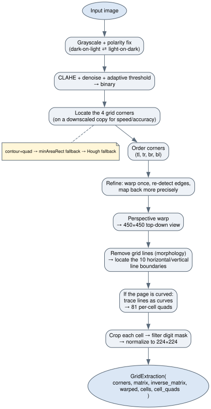
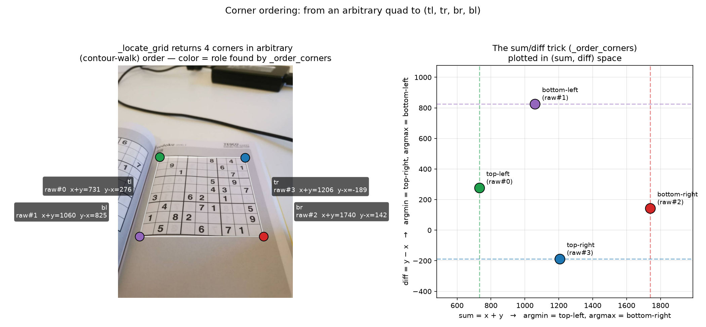
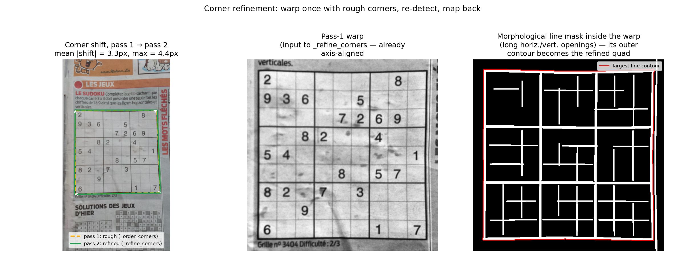
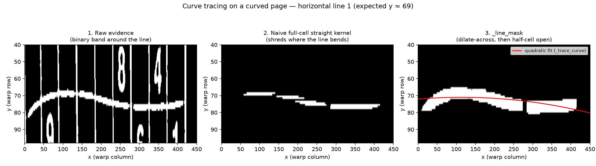
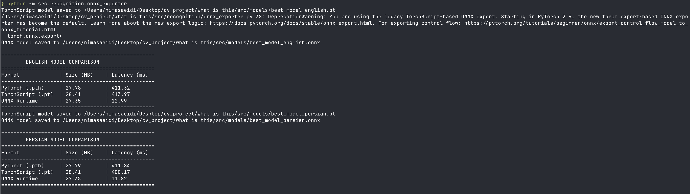

# بخش اول: پیش پردازش

<p align="center">
  
</p>

## ۱. آماده‌سازی تصویر: پولاریتی، نور، نویز


پیش‌فرض کل پایپلاین این است که جوهر تیره روی کاغذ روشن است. اما ممکن است در یک برنامه dark-mode باشد و رقم روشن روی زمینه سیاه باشد. اگر این حالت تشخیص داده نشود الگوریتم ها در ادامه مشکل میخورند

منطق تشخیص: ۶۰٪ مرکزی تصویر را برمی‌داریم (تا لبه‌های عکس مثلا میز تیره رای ها را خراب نکنند)، با Otsu آن را به دو کلاس تبدیل میکنیم، و چون زمینه گرید همیشه اکثریت پیکسل‌ها را تشکیل می‌دهد، هر کلاسی که اکثریت را دارد همان پس‌زمینه واقعی است. اگر اکثریت تیره باشد یعنی پس‌زمینه تیره است و تصویر را invert می‌کنیم.

### CLAHE → median blur → Gaussian blur → adaptive threshold

هر کدام یک مشکل مجزا را می‌پوشانند:

| الگوریتم                                          | مشکلی که حل می‌کند                                                                        |
| ------------------------------------------------- | ----------------------------------------------------------------------------------------- |
| CLAHE (contrast محلی)                             | نور کم، سایه‌های نامنظم روی صفحه                                                          |
| median blur                                       | نویز نمک و فلفل                                                                           |
| Gaussian blur                                     | صاف کردن نویز باقی‌مانده قبل از threshold                                                 |
| adaptive threshold (`ADAPTIVE_THRESH_GAUSSIAN_C`) | چون آستانه به‌صورت محلی محاسبه می‌شود، نور نامنظم کل تصویر باعث خرابی باینری‌سازی نمی‌شود |

### `MAX_DETECT_DIM`

یک adaptiveThreshold با blockSize=11 برای تصاویر تا  حدود ۱۰۲۴ پیکسل خوب عمل میکند شد. برای  عکس گوشی های جدید با رزولوشن بالا مثل ۵۷۱۲×۴۲۸۴، یک بلوک ۱۱ پیکسلی فقط ۰.۲٪ عرض تصویر است. یعنی threshold به نویز تک‌پیکسلی واکنش نشان می‌دهد نه به خطوط گرید، و لبه بیرونی گرید به‌جای یک کانتور
بسته، به صدها قطعه ریز می‌شکند.
راه‌حل: برای *تشخیص* گوشه‌ها تصویر را به حداکثر ۱۰۲۴ پیکسل ریسایز می‌کنیم و کل پیش‌پردازش (CLAHE→blur→threshold) را دوباره روی نسخهٔ کوچک اجرا می‌کنیم. گوشه‌های پیدا‌شده را هم بر اساس اسکیل تبدیل به مختصات تصویر اصلی برمی‌گردانیم. warp پرسپکتیو نهایی همچنان روی تصویر تمام‌رزولوشن انجام می‌شود و کوچک کردن فقط برای مرحله تشخیص است.

---

## ۲. پیدا کردن گرید:

در اینجا استراتژی سه‌لایه پیاده سازی کردیم و هر لایه fallback لایه قبلی است:

1. روش اول: **کانتور + چندضلعی محدب.** بزرگ‌ترین ۵ کانتور خارجی را می‌گیریم و با چند مقدار epsilon که در اصل ارور مارجیم ما میشود سعی می‌کنیم آن را به یک چهارضلعی محدب تبدیل کنیم.
2. روش دوم:  وقتی لبه بیرونی گرید کم‌رنگ‌تر از خطوط داخلی جداکننده
   بلوک‌های ۳×۳ است، کانتور بیرونی آنقدر ناصاف می‌شود که هرگز به یک چهارضلعی تمیز نمی‌رسد، و حلقه بدون این fallback به یک بلوک داخلی کوچک که همون cell ها یا بخشی از گرید تبدیل میشود.
3. روش سوم:  اگر هیچ کانتوری کار نکرد، خطوط را با HoughLines پیدا می‌کنیم، بر اساس زاویه θ به افقی/عمودی تقسیم می‌کنیم، و از میان خطوط افقی/عمودی، دورترین‌ها از مرکز (بالاترین/پایین‌ترین/چپ‌ترین/راست‌ترین) را به‌عنوان ۴ ضلع گرید در نظر می‌گیریم.

قبل از تشخیص، تصویر باینری با copyMakeBorder کمی حاشیه اضافه میکنیم:
اگر لبه گرید دقیقا به لبه عکس بچسبد، کانتور هرگز بسته نمی‌شود. حاشیه این را حل می‌کند و در پایان از
مختصات برگشتی کم می‌شود.

###  ترتیب ثابت گوشه‌ها

با فرض این‌که چرخش کمتر از ۴۵ درجه است یک ترفند ساده میتوانیم بزنیم:
نقطه بالا چپ کمترین `x+y` را دارد، پایین راست بیشترین `x+y` را؛ نقطه بالا راست کمترین `y−x` و پایین-چپ بیشترین `y−x` را. این روش بدون هیچ threshold زاویه‌ای، ۴ گوشه را به ترتیب درست پیدا میکند.




### دور دوم برای گوشه‌های دقیق‌تر

گوشه‌های دور اول معمولا کمی نادقیق‌اند.
ایده: یک بار با همین گوشه‌های خام warp می‌زنیم، و چون تصویر warp‌شده صاف و axis aligned است، پیدا کردن خطوط گرید در آن (با opening افقی/عمودی) خیلی تمیزتر از تصویر پرسپکتیو خام است. کانتور
بیرونی خطوط گرید در warp دوباره quad می‌شود، و با `inverse` همان ماتریس warp اول، این
گوشه دقیق‌تر به فضای تصویر اصلی برمی‌گردد. اگر کانتور warp خیلی کوچک بود یا از قبل تقریبا کل warp را پوشانده بود،کاری انجام نمیدهیم.





---

## ۳. Warp پرسپکتیو 

در warp_destination  گوشه‌ها را نه دقیقا به لبهٔ تصویر ۴۵۰×۴۵۰، بلکه با یک حاشیه CELL_SIZE/2 به داخل نگاشت می‌کند. روی صفحات کتاب خمیده، لبه واقعی گرید یک قوس است نه یک خط راست، و اگر گوشه‌ها دقیقا روی لبه warp بروند، هر جای قوس بیرون‌تر از وتر گوشه‌به‌گوشه برود، clip می‌شود.

---

## ۴. پردازش warp: حذف خطوط گرید و پیدا کردن مرزها

 دو باینری جدا از warp درست میکنیم:
  یکی با threshold آسان‌گیرتر (`C=10`) برای تشخیص خود خطوط، یکی سخت‌گیرتر (`C=15`) برای تشخیص رقم. 
در کد ما  median blur حفره‌های داخل ارقام مثل ۶/۸/۹ را کمی پر می‌کند. threshold اسان آن حفره‌ها
را باز نگه می‌دارد و برای تشخیص خط کافی است، اما threshold سخت‌گیر برای رقم لازم است تا
نویز اضافه به رقم باقی نماند.

### حذف خطوط با مورفولوژی

یک kernel به صورت خط به طول CELL_SIZE درست میکنیم و با ان روی تصویر باینری open میزنیم. با این کار تنها خط های درون تصویر برای ما باقی می ماند.

### پیدا کردن موقعیت ۱۰ خط

خطوط گرید در ماسک افقی/عمودی، وقتی روی محور عمود بر خودشان جمع (sum) شوند، یک پیک ایجاد می‌کنند. چون در امتداد آن ردیف/ستون تقریبا همه پیکسل‌ها سفیدند، برخلاف نواحی بین‌خطی که بیشتر سیاه‌اند.

برای هر یک از ۱۰ خط مورد انتظار (موقعیت‌های یکنواخت)، یک پنجره جست‌وجوی کوچک اطراف موقعیت پیش‌بینی‌شده باز می‌کنیم و داخل آن دنبال بیشینه پروفایل می‌گردیم. اگر بیشینه آن پنجره به‌اندازه کافی بلند نبود (کمتر از ۳۰٪ عرض warp)، یعنی کافی برای آن خط نیست و موقعیت پیش‌بینی‌شده یکنواخت را به‌جایش می‌گذاریم. در پایان np.maximum.accumulate تضمین می‌کند خطوط پیاپی هرگز از هم عبور نکنند (خط ۵ نمی‌تواند
قبل از خط ۴ بیاید).

![[line_finding.png]]

---

## ۵. صفحات خمیده

یک homography تنها یک صفحه تخت را مدل می‌کند. روی صفحه خمیده، ۴ گوشه درست map
می‌شوند اما خطوط *بین* گوشه‌ها همچنان داخل warp خمیده باقی می‌مانند. پس تقسیم یکنواخت
۹×۹  وسط گرید از خانه واقعی منحرف می‌شود.
راه‌حل: به‌جای فرض خط راست، هر خط را به‌صورت یک منحنی ردیابی می‌کنیم و ۸۱ خانه را هرکدام با homography مخصوص به خودش برش می‌زنیم.

### شواهد خط که در برابر خمیدگی دوام می‌آورد

اگر مستقیما همان کرنل remove_grid_lines را روی خط خمیده اعمال کنیم، opening دقیقا همان‌جا که خمیدگی بیشترین است خط را از بین می‌برد.

- ابتدا خط را عمود بر جهت خودش کمی dilate می‌کنیم. یک خط خمیده ضخیم‌شده همیشه یک بخش کاملا صاف در دلش دارد، پس opening بعدی آن را از بین نمی‌برد.
- سپس با یک kernel با اندازه نصف طول خانه opening می‌کنیم. این دو برابر شیب محلی بیشتری را تحمل می‌کند.
- در پایان فقط connected components با طول ≥ یک خانه کامل نگه داشته
  می‌شوند.

### یک منحنی صاف برای هر خط

اطراف موقعیت مورد انتظار هر خط، یک نوار برمی‌داریم، در هر ستون از آن نوار centroid عمودی پیکسل‌های ماسک را حساب می‌کنیم (میانگین وزنی موقعیت y)، و یک چندجمله‌ای درجه ۲ از این نقاط عبور می‌دهیم.



###  جمع‌بندی به ۸۱ چهارضلعی

- در سطح هر خط، خطی که ردیابی نشد، به‌جای حذف، به‌صورت یک خط راست در موقعیت `_grid_boundaries` جایگزین میکنیمو
- اگر کمتر از ۸ از ۲۰ خط قابل ردیابی بود، کل این راهکار را کنار میگذاریم و همان تقسیم یکنواخت قبلی استفاده میکنیم
-  منحنی‌های افقی به‌شکل `y = f_i(x)` و عمودی به‌شکل `x = g_j(y)` هستند. با جایگذاری نقطه تقاطع همگرا می‌شود. ۱۰۰ نقطهٔ تقاطع  به ۸۱ چهارضلعی تبدیل می‌شوند.

---

  

## چالش‌های اصلی

### ۱. تشخیص جهت


یک چالش اصلی که وجود دارد این هست که عکس از سودوکو ما ممکن است کاملا جهت های مختلف داشته باشد. در طول پروژه چند راه حل برای ان انجام دادیم که در پایین اوردیم:

**تلاش اول - استفاده از CNN روی تصویر خام:** ابتدا یک Classifier مستقیم روی تصویر ورودی (پیش از هرگونه پردازش) آموزش دادیم تا زوایای ۰، ۹۰، ۱۸۰ و ۲۷۰ درجه را تشخیص دهد.
نتیجه: این روش روی داده‌های تست شکست خورد. تنوع پس‌زمینه، نور، زاویه دوربین و پرسپکتیو در تصاویر خام به قدری زیاد بود که مدل به جای یادگیری جهتِ گرید، روی نویزِ این متغیرها بیش‌برازش (Overfit) می‌شد.

 **تلاش دوم - استفاده از CNN روی تصویر Warped شده:** به جای تصویر خام، مدل را روی خروجی مرحله ششم (تصویر ۴۵۰×۴۵۰ صاف و هم‌راستا با محورها که از warp پرسپکتیو به دست می‌آید) آموزش دادیم. با حذف پرسپکتیو و پس‌زمینه، نتایج بسیار بهتر شد اما همچنان کافی نبود. مشکل اصلی تشخیص زوایای متقارن (مثل ۱۸۰ درجه یا تمایز ۹۰ و ۲۷۰) بود. برای مثال مدل باید تفاوت عدد ۶ وارونه و ۹ را درک می‌کرد. یادگیری این الگوها از پایه، نیازمند مجموعه داده عظیمی از ارقام در زوایای مختلف بود که در دسترس نداشتیم.

**راه‌حل نهایی - استفاده از مدل تشخیص ارقام:** به این نتیجه رسیدیم که از مدلی که پیش‌تر برای درک ساختار ارقام توسعه داده بودیم (مدل فاز ۲) استفاده کنیم. به جای آموزش یک شبکه جدید جهت‌یاب، هر ۴ چرخش ممکن Warp را شبیه‌سازی کردیم. در هر حالت، تمام ۸۱ خانه توسط مدل خوانده می‌شود و در نهایت، چرخشی که بیشترین میانگین اطمینان (Confidence) را در تشخیص ارقام داشته باشد، انتخاب میکنیم. به عبارت دیگر، چالش جهت‌یابی با استفاده از دانش پیشین مدل رقم‌شناس حل شد.

### ۲. گرید چسبیده به دور عکس

درحالتی که پدینگ نداشتیم و عکسی تست میکردیم که کل عکس دقیقا کل گرید باشد نتایج خوبی برای کرنر های گرید نمیگرفتیم. با اضافه کردن پدینگ این مشکل را حل کردیم:

عکس اولیه:

![[whole_grid.png|700x700]]


نتیجه اولیه:

![[Pasted image 20260714164133.png]]


نتیجه اصلاح شده:


![[08b_line_curves 1.png]]


### ۳. صفحات خمیده و تاخورده 

تصاویر ثبت‌شده از روی کتاب‌ها معمولا دارای انحنا هستند که استخراج گرید را پیچیده می‌کند.

**تلاش اول - رویکرد سراسری (Global):** فرض اولیه این بود که می‌توان کل شبکه را با یک شبکه‌بندی یکنواخت به ۸۱ خانه تقسیم کرد. اما مشکل داشت. تبدیل هموگرافی تنها روی سطوح کاملا تخت کارآمد است. در صفحات خمیده، حتی اگر ۴ گوشه به درستی نگاشت شوند، خطوط میانی همچنان دچار اعوجاج و انحنا هستند. بنابراین، هرگونه تقسیم‌بندی سراسری که خطوط را صاف فرض کند، در بخش‌های مرکزیِ گرید دچار خطای محاسباتی می‌شود.

**راه‌حل - تبدیل مسئله از Global به Local:** به جای حل یک‌باره کل شبکه، مسئله را به ۸۱ زیرمسئله مستقل تقسیم کردیم. فرآیند به این شکل است:
- ۱. هر یک از ۲۰ خط شبکه (۱۰ افقی و ۱۰ عمودی) به صورت یک منحنی مستقل ردیابی می‌شوند
- ۲. از تقاطع این منحنی‌ها، ۱۰۰ نقطه دقیق به دست می‌آید
- ۳. در نهایت، هر خانه با هموگرافی اختصاصی خودش برش می‌خورد


قبل از درست کردن:

![[curve_prob.png|600x600]]


بعد از درست کردن:

![[08b_line_curves.png]]

---

# بخش دوم: مدل‌ها و فاین‌تیونینگ


این سند مدل‌های تشخیص رقم استفاده‌شده در حل‌کننده سودوکو، مسیری که برای
رسیدن به رسپی نهایی فاین‌تیونینگ طی شد، منطق تشخیص خودکار جهت/زبان که در
زمان استنتاج (inference) استفاده می‌شود، و خروجی ONNX که برای سریع کردن API
تا حد قابل سرویس‌دهی به کار رفته را توضیح می‌دهد.

> تمام نوت‌بوک‌های آزمایشی (اجراهای واقعی آموزش، نمودارها، بررسی سلامت
> دیتاست و غیره) در **`/notebooks`** قرار دارند که **gitignore شده** و بخشی
> از تاریخچه این ریپو نیست. این سند، شرح کاری است که آنجا انجام شده؛ خود
> نوت‌بوک‌ها فقط به‌صورت محلی و به عنوان فایل‌های آزمایشی موجودند.

## ۱. معماری مدل

هر دو کلاسیفایر رقم انگلیسی و فارسی دقیقاً از یک معماری مشترک استفاده
می‌کنند که یک‌بار در `src/recognition/model.py` تعریف شده است:

- بک‌بون: `torchvision.models.efficientnet_b1`، از پیش آموزش‌دیده روی
  ImageNet (`EfficientNet_B1_Weights.DEFAULT`).
- سر کلاسیفایر (classifier head) با موارد زیر جایگزین شده:
  `Dropout(0.3) -> Linear(1280, 512) -> Dropout(0.2) -> Linear(512, 10)`
  (۱۰ کلاس: ارقام ۰ تا ۹، که `0` به معنای «بدون رقم / خانه خالی» است).
- ورودی: تصویر RGB با ابعاد 224x224، نرمال‌سازی‌شده با `mean=0.5, std=0.5`.

تنها تفاوت میان مدل‌های انگلیسی و فارسی این است که روی چه وزن‌هایی
فاین‌تیون شده‌اند — کد یکسان، دو چک‌پوینت
(`src/models/best_model_english.pth`، `src/models/best_model_persian.pth`).

## ۲. مدل رقم انگلیسی: سه تلاش

پیش از آن‌که مدل رقم انگلیسی به کیفیت کافی برسد، سه دیتاست را امتحان
کردیم. هر سه از معماری یکسان و رسپی فاین‌تیونینگ دو‌مرحله‌ای یکسان (بخش ۴)
استفاده کردند — تنها چیزی که میان تلاش‌ها تغییر کرد **داده‌ی آموزشی** بود.

### تلاش ۱ — Chars74K «Fnt» (کاراکترهای تایپ‌شده)

`data/English/Fnt/` دیتاست کاراکترهای **تایپی مصنوعی** Chars74K است. کار را
از اینجا شروع کردیم چون ارقام سودوکو چاپی/تایپی هستند نه دست‌نویس، پس
کاراکترهای فونت تایپی نزدیک‌ترین چیز به آنچه واقعاً در عکس یک شبکه سودوکو
می‌بینیم به نظر می‌رسید.

**نتیجه: کافی نبود.** بعد از پیش‌پردازش استخراج شبکه
(`src/grid_extraction.py` — آستانه‌گذاری، برش تا مؤلفه متصل رقم، padding
به شکل مربع، تغییر اندازه به 224x224، بخش ۶ را ببینید)، برش‌های رقمی
استخراج‌شده‌ی ما به‌طور معناداری با گلیف‌های تایپی تمیز، نور یکنواخت و
کاملاً برش‌خورده تفاوت داشتند. نویز، نور ناهموار، باینری‌سازی ناقص و
آرتیفکت‌های برش دور رقم وجود دارد. نتیجه یک **اسکیو (skew) بین آموزش و
سرویس‌دهی** بود: مدل روی ارقام تایپی تمیز قوی بود اما روی برش‌های واقعیِ
پیش‌پردازش‌شده‌ی ما ضعیف.

### تلاش ۲ — MNIST (ارقام دست‌نویس)

سپس `data/mnist/` (دیتاست استاندارد ارقام دست‌نویس MNIST) را امتحان کردیم.
این در عمل بهتر از تلاش Chars74K عمل کرد، اما همچنان راضی‌کننده نبود. علت
ریشه‌ای همان قبلی بود: **اسکیو بین آموزش و سرویس‌دهی**. ارقام MNIST به
شکلی مرکزیت‌یافته، بدون نویز و نرمال‌شده هستند که برش‌های واقعیِ
پیش‌پردازش‌شده‌ی ما این‌طور نیستند — آمار استروک متفاوت، قاب‌بندی متفاوت،
پروفایل نویز متفاوت.

### تلاش ۳ (نهایی، نسخه‌ی تولید) — فاین‌تیون مستقیم روی خانه‌های پیش‌پردازش‌شده‌ی سودوکو

راه‌حل این بود که به‌جای تلاش برای پیدا کردن دیتاستی از ارقام که فقط
*شبیه* ارقام سودوکو *به نظر می‌رسد*، دیتاستی بسازیم که **خروجیِ همان
پایپ‌لاین پیش‌پردازش خودمان** باشد:

۱. یک دیتاست تصویر پازل سودوکو برداریم (کگل
   [`mexwell/sudoku-image-dataset`](https://www.kaggle.com/datasets/mexwell/sudoku-image-dataset/data)،
   ذخیره‌شده در `data/sudoku/` — `v1_training`، `v2_train` و غیره، همراه با
   حاشیه‌نویسی گوشه‌ها در `outlines_sorted.csv`).
۲. هر تصویر را از `src/grid_extraction.py` عبور دهیم (دقیقاً همان مسیر
   کدی که در تولید استفاده می‌شود) تا وارپ شود، به ۸۱ خانه تقسیم شود و هر
   برش رقم پاک‌سازی شود.
۳. هر خانه‌ی استخراج‌شده را با برچسب واقعی‌اش جفت کنیم تا یک دیتاست
   پوشه‌به‌ازای‌هر‌کلاس بسازیم:
   `data/digit_finetune_dataset/{train,test}/<digit 0-9>/*.png`.
۴. EfficientNet-B1 را روی *همان* دیتاست فاین‌تیون کنیم.

این کار شکاف بین آموزش و سرویس‌دهی را کاملاً می‌بندد، چون تصاویر آموزشی
توسط دقیقاً همان پایپ‌لاینی تولید می‌شوند که مدل در زمان استنتاج می‌بیند.
این همان رویکردی است که «به‌هدف زد» — چیزی است که
`src/models/best_model_english.pth` روی آن آموزش دیده و چیزی است که API
واقعاً سرویس می‌دهد.

## ۳. مدل رقم فارسی

معماری یکسان، رسپی دو‌مرحله‌ای یکسان، اما داستان داده متفاوت است چون هیچ
دیتاست آماده‌ی «سودوکوی فارسی» وجود ندارد:

۱. **ارقام دست‌نویس — دیتاست هدی.** `data/hoda-dataset/DigitDB/`
   (`Train 60000.cdb` / `Test 20000.cdb`، خوانده‌شده از طریق
   `notebooks/HodaDatasetReader.py`) یک دیتاست استاندارد رقم دست‌نویس فارسی
   است. فاین‌تیون روی آن نتایجی قابل‌مقایسه با تلاش MNIST انگلیسی داد —
   قابل قبول، اما روی برش‌های واقعیِ پیش‌پردازش‌شده‌ی ما کافی نبود، به همان
   دلیل اسکیوِ بین آموزش و سرویس‌دهی مثل تلاش ۲ انگلیسی.
۲. **هیچ دیتاست سودوکوی فارسی‌ای وجود ندارد**، پس یکی را به‌صورت مصنوعی با
   استفاده از اسکریپت‌های `/scripts` ساختیم:
   - `scripts/persian_digit_dataset.py` پازل‌های سودوکوی فارسیِ جعلیِ
     «عکس‌گرفته‌شده» را از صفر تولید می‌کند: یک شبکه‌ی ۹×۹ تصادفی می‌چیند،
     ارقام فارسی (۱–۹) را با یک فونت واقعی فارسی (`scripts/Yekan.ttf`)
     رندر می‌کند، پازل تمیز را روی یک پرسپکتیو تصادفی وارپ می‌کند (شبیه‌سازی
     عکسی که با زاویه گرفته شده)، و سپس تخریب‌های تصادفی — چرخش/مقیاسِ
     ظریف، نور کم، نویز گاوسی، بلور و گرادیان‌های سایه‌ی جهت‌دار — را برای
     تقلید شرایط واقعی عکس اعمال می‌کند.
   - سپس `scripts/build_persian_finetune_dataset.py` آن تصاویر مصنوعی را
     از **همان** پایپ‌لاین `src/grid_extraction.py` که در تولید استفاده
     می‌شود عبور می‌دهد (دقیقاً مثل مرحله‌ی ۲/۳ تلاش ۳ انگلیسی در بالا)، و
     یک دیتاست برچسب‌خورده به‌ازای‌هر‌کلاس در
     `data/persian_digit_finetune_dataset/{train,test}/<digit 0-9>/*.png`
     تولید می‌کند.
۳. فاین‌تیون روی این دیتاست مصنوعی-اما-هم‌راستا‌با‌پایپ‌لاین همان چیزی است
   که برای فارسی واقعاً خوب عمل کرد و همان چیزی را که برای انگلیسی جواب
   داد بازتاب می‌دهد: تطبیق توزیع آموزشی با توزیع *پیش‌پردازش‌شده*، نه با
   یک دیتاست عمومیِ «ارقام تمیز».

(`best_model_persian_soft.pth` / `best_model_persian_hard.pth` در
`src/models/` چک‌پوینت‌های قدیمی‌تری از نسخه‌های تقویت‌داده‌ی (augmentation)
نرم‌تر/سخت‌تر این دیتاست هستند، که برای مقایسه نگه داشته شده‌اند؛
`best_model_persian.pth` همان چیزی است که واقعاً استفاده می‌شود.)

## ۴. قرارداد فاین‌تیونینگ

برای تمام اجراهای فاین‌تیونینگ تشخیص رقم (`src/recognition/train.py`) از
قرارداد یادگیری انتقالی (transfer learning) توضیح‌داده‌شده در راهنمای
تنسورفلو
[Transfer learning and fine-tuning](https://www.tensorflow.org/tutorials/images/transfer_learning)
پیروی کردیم، که برای PyTorch/EfficientNet تطبیق داده شده است:

- **لایه‌های BatchNorm هرگز آموزش داده نمی‌شوند.** طبق توصیه‌ی راهنما، ما
  اجازه نمی‌دهیم لایه‌های BatchNorm آمار running خود را در طول فاین‌تیونینگ
  به‌روزرسانی کنند — به‌روزرسانی آمار BN روی یک مجموعه‌ی فاین‌تیونینگ کوچک با
  توزیعی متفاوت از مجموعه‌ی پیش‌آموزش اصلی، معمولاً بیش‌تر ضرر می‌زند تا
  کمک کند. در `train.py`، هر ماژول `BatchNorm2d` در گام آموزش به حالت
  `.eval()` مجبور می‌شود (حتی وقتی بقیه‌ی مدل در حالت `.train()` است)، پس
  لایه‌های BN همیشه در حالت استنتاج اجرا می‌شوند و صرف‌نظر از این‌که کدام
  پارامترها آزاد شده باشند، از آموزش مستثنا هستند.
- **فاین‌تیونینگ دو‌مرحله‌ای:**
  ۱. **مرحله ۱ — بک‌بون منجمد.** `model.features` (بک‌بون EfficientNet-B1،
     شروع‌شده از وزن‌های ImageNet) به‌طور کامل منجمد می‌شود
     (`requires_grad = False`). فقط سر کلاسیفایر جدید با
     `Adam(lr=1e-3)` به مدت ۶ epoch آموزش می‌بیند. این کار اجازه می‌دهد سر
     جدید بدون مختل کردن ویژگی‌های پیش‌آموزش‌دیده، خودش را با خروجی ۱۰
     کلاسه‌ی رقم تطبیق دهد.
  ۲. **مرحله ۲ — فاین‌تیون جزئی بک‌بون.** آخرین بلوک بک‌بون
     (`model.features[-3]`) همراه با سر کلاسیفایر آزاد می‌شود، و آموزش با
     نرخ یادگیری بسیار پایین‌تری (`Adam(lr=1e-5)`) به مدت ۱۰ epoch ادامه
     پیدا می‌کند، در حالی که بهترین چک‌پوینت بر اساس دقت اعتبارسنجی نگه
     داشته می‌شود. لایه‌های BatchNorm در طول این مرحله نیز منجمد باقی
     می‌مانند (به بالا مراجعه کنید).

این الگو، الگوی «ابتدا سر را آموزش بده، سپس بخشی از بک‌بون را با نرخ
یادگیری پایین آزاد کن» در راهنما را بازتاب می‌دهد، با قید BN-منجمد که در
هر دو مرحله اعمال شده است.

## ۵. تشخیص خودکار در زمان استنتاج: جهت و زبان

عکس سودوکویی که API دریافت می‌کند ممکن است ۰/۹۰/۱۸۰/۲۷۰ درجه چرخیده باشد
و ممکن است یک پازل انگلیسی یا فارسی باشد. هر دو با یک روش یکسان حل
می‌شوند — با رأی‌گیری brute-force توسط خود مدل تشخیص، در
`src/orientation/infer.py::resolve_orientation` و
`src/api/app.py::solve_sudoku`:

**جهت (۰/۹۰/۱۸۰/۲۷۰):** برای هر چرخش کاندیدا، شبکه دوباره به ۸۱ خانه برش
داده می‌شود (`rotate_extraction` در `src/grid_extraction.py`، که تقسیم
خانه‌ها را دوباره از هندسه‌ی وارپ استخراج می‌کند به‌جای این‌که صرفاً
پیکسل‌ها را بچرخاند)، هر خانه‌ی غیرخالی طبقه‌بندی می‌شود، و **میانگین
اطمینان روی تمام پیش‌بینی‌های غیرخالی** را می‌گیریم. چرخشی که بالاترین
میانگین اطمینان را دارد برنده می‌شود. این کار مستقل برای مدل انگلیسی و
مدل فارسی انجام می‌شود.

**زبان (انگلیسی در برابر فارسی):** با بهترین چرخش پیداشده برای هر زبان،
پیش‌بینی کل شبکه برای هر زبان را با `_grid_score()` در `src/api/app.py`
امتیازدهی می‌کنیم و هر زبانی را که شبکه‌اش ارقام با اطمینان بیشتری تشخیص
داده انتخاب می‌کنیم (تساوی‌ها با اطمینان شکسته می‌شوند). زبان برنده،
جهتِ استفاده‌شده را نیز تعیین می‌کند، چون جهت به‌ازای هر زبان جداگانه حل
شده بود.

### چرا یک کلاسیفایر جهت اختصاصی نه؟

یک کلاسیفایر چرخش ۴ کلاسه‌ی اختصاصی هم آموزش دادیم
(`src/orientation/model.py` — یک سر ResNet18 که `{0°, 90°, 180°, 270°}`
را پیش‌بینی می‌کند، آموزش‌دیده از طریق `src/orientation/train.py`)
به‌جای رویکرد رأی‌گیری brute-force بالا. **به‌اندازه‌ی کافی خوب کار نکرد
که استفاده شود.**

مشکل اصلی: چند رقم تقریباً تصویر آینه‌ایِ چرخش ۱۸۰ درجه‌ی خودشان هستند —
به‌طور خاص **۶/۹ در انگلیسی** و **۷/۸ در فارسی** (۷/۸) — پس مدلی که به
کل شبکه‌ی وارپ‌شده نگاه می‌کند، همیشه نمی‌تواند جهت را از سردرگمی هویت رقم
تشخیص دهد، و یک کلاسیفایر جهتِ صرفاً بصری/هندسی دقیقاً در همان مواردی که
اهمیت بیشتری دارند دچار مشکل می‌شود. رویکرد brute-force «همه‌ی ۴ چرخش را
امتحان کن، هرکدام که به مدل تشخیص بیشترین اطمینان را می‌دهد نگه دار» این
مشکل را دور می‌زند، چون اجازه می‌دهد خودِ مدل تشخیص رقم (که چیزی است که
واقعاً برایمان مهم است درست باشد) داور نهایی باشد، به‌جای اعتماد به یک
سیگنال جهتِ جداگانه و ضعیف‌تر. کد کلاسیفایر جهت در ریپو نگه داشته شده اما
به endpoint تولیدیِ `/solve` وصل نیست.

## ۶. استخراج شبکه / پیش‌پردازش (زمینه برای بخش‌های ۲–۳)

یک مدل نیست، اما مرتبط است چون چیزی است که هم «داده‌ی فاین‌تیونینگ باید
چه شکلی باشد» را تعریف می‌کند و هم در زمان استنتاج اجرا می‌شود:
`src/grid_extraction.py` شبکه‌ی سودوکو را در یک عکس پیدا می‌کند (آستانه‌گذاری
تطبیقی + تشخیص contour/خط هاف)، آن را با پرسپکتیو به یک بوم ثابت 450x450
وارپ می‌کند، خطوط شبکه را حذف می‌کند، هر یک از ۸۱ خانه را پیدا می‌کند (با
یک fallback ردیابیِ خط منحنی برای عکس‌های کج‌شده/تاخورده)، مؤلفه‌ی متصلِ
رقم را در هر خانه جدا می‌کند (با فیلتر کردن نویز/لکه‌ها بر اساس اندازه،
نسبت ابعاد و چگالی پر شدن)، و آن را نرمال‌سازی/padding/تغییر اندازه به
224x224 می‌کند. این دقیقاً همان تابعی است که توسط
`build_persian_finetune_dataset.py` و مرحله‌ی معادل ساخت دیتاست انگلیسی
دوباره استفاده می‌شود تا مطمئن شویم داده‌ی آموزشی پیکسل‌به‌پیکسل با داده‌ی
سرویس‌دهی تطابق دارد.

## ۷. خروجی ONNX

### ONNX چیست و چرا از آن استفاده می‌کنیم

ONNX (Open Neural Network Exchange) یک فرمت قابل‌حمل برای مدل است: به‌جای
سرویس‌دهیِ یک مدل PyTorch که برای اجرای یک forward pass به رانتایم کامل
PyTorch (پایتون، ماشین‌آلاتِ autograd، ترسیم گراف پویا و غیره) نیاز دارد،
گراف محاسباتیِ مدل آموزش‌دیده یک‌بار در یک فایل استاتیک `.onnx` صادر
می‌شود و توسط **ONNX Runtime** (`onnxruntime`) اجرا می‌شود، یک موتور
استنتاج سبک و بهینه‌شده در سطح گراف (ادغام عملگرها، constant folding،
انتخاب بهتر کرنل CPU) بدون وابستگی به PyTorch در زمان درخواست.

`src/recognition/onnx_exporter.py` این خروجی‌گیری را انجام می‌دهد:

- وزن‌های فاین‌تیون‌شده‌ی `.pth` را در معماری EfficientNet-B1 بارگذاری
  می‌کند.
- آن را با `torch.jit.trace` ردیابی می‌کند و یک فایل TorchScript `.pt`
  ذخیره می‌کند (یک نقطه‌ی مقایسه‌ی میانی).
- آن را از طریق `torch.onnx.export` (opset 17، محور batch پویا) به ONNX
  صادر می‌کند، و `src/models/best_model_english.onnx` و
  `src/models/best_model_persian.onnx` را تولید می‌کند.
- هر سه فرمت (PyTorch `.pth`، TorchScript `.pt`، ONNX Runtime) را روی
  ۱۰۰ forward pass (۱۰ اجرای گرم‌کردنی) بنچمارک می‌کند و جدول مقایسه‌ی
  اندازه/تأخیر (latency) را چاپ می‌کند.

`src/recognition/onnx_infer.py` معادلِ ONNX-Runtime برای
`src/recognition/infer.py` است: دو فایل `.onnx` را در آبجکت‌های
`onnxruntime.InferenceSession` (execution provider مربوط به CPU) بارگذاری
می‌کند و همان رابط `predict_cell` / `predict_cell_proba` را ارائه می‌دهد،
پس بقیه‌ی کدبیس لازم نیست بداند کدام backend فعال است.

### نتیجه (`onnx_result.png`)



اجرای `python -m src.recognition.onnx_exporter` هر دو مدل زبان را دوباره
خروجی می‌گیرد و این مقایسه را چاپ می‌کند:

| فرمت                 | اندازه انگلیسی | تأخیر انگلیسی | اندازه فارسی | تأخیر فارسی |
|---------------------|-------------:|-----------------:|--------------:|------------------:|
| PyTorch (`.pth`)    | 27.78 MB     | 411.32 ms         | 27.79 MB       | 411.84 ms          |
| TorchScript (`.pt`) | 28.41 MB     | 413.97 ms         | 28.41 MB       | 400.17 ms          |
| **ONNX Runtime**    | **27.35 MB** | **12.99 ms**      | **27.35 MB**   | **11.82 ms**       |

ردیابی TorchScript به‌تنهایی عملاً هیچ سودی نسبت به PyTorch eager نداشت
(هر دو حدود ۴۰۰ میلی‌ثانیه) — گلوگاه، ترسیم گراف نیست، بلکه خودِ مسیر
اجرای CPU در PyTorch است. ONNX Runtime، روی همان وزن‌ها و همان CPU،
**حدود ۳۰ تا ۳۵ برابر سریع‌تر** است (≈۴۱۱ میلی‌ثانیه → ≈۱۲ میلی‌ثانیه به
ازای هر forward pass تک‌تصویری)، با فایلی که کمی *کوچک‌تر* از هر دو فرمت
PyTorch است.

**چرا این موضوع دقیقاً برای این پروژه اهمیت دارد:** یک درخواست `/solve`
تا **۸۱ خانه** را طبقه‌بندی می‌کند. با ~۴۱۰ میلی‌ثانیه به ازای هر خانه
(PyTorch)، یک شبکه‌ی کامل تقریباً **۸۱ × ۰.۴۱s ≈ ۳۳ ثانیه** به ازای هر
درخواست طول می‌کشد — برای یک endpoint HTTP همزمان قابل قبول نیست، به‌خصوص
که حلِ جهت به‌تنهایی مدل تشخیص را روی تا ۴ چرخش کاندیدا به ازای هر زبان
اجرا می‌کند قبل از این‌که یک شبکه حتی نهایی شود. با ~۱۲ میلی‌ثانیه به ازای
هر خانه (ONNX)، همان ۸۱ خانه **≈۱ ثانیه** طول می‌کشد. این بنچمارک دلیلی
است که `src/api/app.py`، `RECOGNITION_BACKEND = "onnx"` را تنظیم می‌کند و
در زمان راه‌اندازی به‌جای وزن‌های خام `.pth`،
`src/recognition/onnx_infer.load_model()` را بارگذاری می‌کند — مدل‌های
ONNX چیزی هستند که API مستقر واقعاً اجرا می‌کند.

## ۸. مرجع فایل/پوشه

```
src/
  models/                        # gitignore شده (*.pth, *.pt, *.onnx) — وزن‌های آموزش‌دیده و خروجی‌ها
    best_model_chars.pth             # تلاش ۱: EfficientNet-B1 فاین‌تیون‌شده روی کاراکترهای تایپی Chars74K — منسوخ
    best_model_mnist.pth             # تلاش ۲: EfficientNet-B1 فاین‌تیون‌شده روی ارقام دست‌نویس MNIST — منسوخ
    best_model_english.pth           # تلاش ۳ (نهایی): فاین‌تیون‌شده روی برش‌های پیش‌پردازش‌شده‌ی خانه‌های سودوکو — وزن‌های تولیدی انگلیسی
    best_model_persian.pth           # وزن‌های نهایی فارسی: هدی + برش‌های مصنوعیِ سودوکوی فارسی
    best_model_persian_soft.pth      # چک‌پوینت فارسی، نسخه‌ی تقویت‌داده‌ی نرم‌تر — نگه‌داشته‌شده برای مقایسه
    best_model_persian_hard.pth      # چک‌پوینت فارسی، نسخه‌ی تقویت‌داده‌ی سخت‌تر — نگه‌داشته‌شده برای مقایسه
    best_model_english.pt            # خروجی TorchScript از best_model_english.pth
    best_model_persian.pt            # خروجی TorchScript از best_model_persian.pth
    best_model_english.onnx          # خروجی ONNX از best_model_english.pth — در زمان اجرا توسط API بارگذاری می‌شود
    best_model_persian.onnx          # خروجی ONNX از best_model_persian.pth — در زمان اجرا توسط API بارگذاری می‌شود

  recognition/                   # کلاسیفایر رقم: معماری، آموزش، استنتاج (torch + onnx)
    model.py                         # EfficientNet-B1 + سر کلاسیفایر سفارشی؛ وزن‌های .pth را بارگذاری می‌کند
    dataset.py                       # DigitFinetuneDataset — چیدمان پوشه train|test/<0-9>/*.png را می‌خواند
    train.py                         # حلقه‌ی فاین‌تیونینگ دو‌مرحله‌ای (بک‌بون منجمد -> آزادسازی جزئی)، BN منجمد نگه داشته می‌شود
    infer.py                        # predict_cell / predict_cell_proba — به backend torch یا ONNX می‌فرستد
    onnx_exporter.py                 # .pth -> TorchScript (.pt) + ONNX (.onnx) را صادر می‌کند؛ هر ۳ فرمت را بنچمارک می‌کند
    onnx_infer.py                    # پوشش session برای ONNX Runtime، با رابط یکسان با infer.py

  orientation/                   # کلاسیفایر چرخش ۰/۹۰/۱۸۰/۲۷۰ (آزمایشی — در تولید استفاده نمی‌شود، بخش ۵ را ببینید)
    model.py                         # ResNet18، سر ۴ کلاسه
    dataset.py                       # RotationDataset — برش‌های راست را در لحظه می‌چرخاند تا برچسب بسازد
    train.py                         # فاین‌تیون دو‌مرحله‌ای (بک‌بون منجمد -> آزادسازی کامل)
    infer.py                         # OrientationCorrector / WarpOrientationClassifier + resolve_orientation()
                                      #   (resolve_orientation همان تابع رأی‌گیریِ brute-force است که واقعاً توسط API استفاده می‌شود)

  grid_extraction.py             # شبکه را پیدا می‌کند، با پرسپکتیو وارپ می‌کند، به ۸۱ خانه تقسیم می‌کند، هر رقم را پاک‌سازی/نرمال می‌کند
  pipeline.py                    # هماهنگ‌سازی سرتاسری (فعلاً یک stub)
  overlay.py                     # ارقام حل‌شده را روی عکس اصلی رندر می‌کند
  solver.py                      # حل‌کننده‌ی سودوکو با backtracking
  api/app.py                     # سرویس FastAPI — grid_extraction را به تشخیص جهت/زبان -> تشخیص (ONNX) -> solver -> overlay
                                  #   پشت endpoint /solve وصل می‌کند

scripts/                        # اسکریپت‌های یک‌باره برای ساخت دیتاست و QA — توسط اپ سرویس‌دهی‌شده import نمی‌شوند
  persian_digit_dataset.py         # تصاویر جعلیِ «عکس‌گرفته‌شده»ی سودوکوی فارسی را می‌سازد (فونت Yekan.ttf +
                                    #   وارپ پرسپکتیو + نویز/بلور/سایه) — ماده‌ی خامِ دیتاست فارسی
  build_persian_finetune_dataset.py# آن تصاویر را از grid_extraction.py عبور می‌دهد تا یک دیتاست برچسب‌خورده‌ی
                                    #   train/test به‌ازای‌هر‌خانه بسازد — همان مرحله‌ی «پیش‌پردازش» توضیح‌داده‌شده در بخش ۳
  robustness_demo.py               # یک پازل انگلیسی را سنتز می‌کند و grid_extraction.py را تحت
                                    #   بلور / نویز / چرخش / نور کم / سایه استرس‌تست می‌کند
  Yekan.ttf                        # فونت فارسی استفاده‌شده توسط persian_digit_dataset.py

data/                            # gitignore شده — دیتاست‌های خام و مشتق‌شده
  English/Fnt/                     # دیتاست کاراکتر تایپیِ Chars74K (تلاش ۱)
  mnist/                           # ارقام دست‌نویس MNIST (تلاش ۲)
  hoda-dataset/DigitDB/            # دیتاست رقم دست‌نویس فارسی هدی (.cdb، خوانده‌شده توسط notebooks/HodaDatasetReader.py)
  sudoku/                          # عکس‌های خام دیتاست کگل «sudoku-image-dataset» + حاشیه‌نویسی گوشه‌ها (outlines_sorted.csv)
  digit_finetune_dataset/          # دیتاست نهاییِ به‌ازای‌هر‌خانه‌ی انگلیسی (train/test/<0-9>/*.png)، ساخته‌شده از grid_extraction
  persian_digit_finetune_dataset/  # دیتاست نهایی فارسی، ساخته‌شده از تصاویر مصنوعیِ سودوکوی فارسی

notebooks/                       # gitignore شده — تمام نوت‌بوک‌های آزمایش و تست اینجا هستند
  test_digits.ipynb                # آزمایش‌های تلاش ۱ (Chars74K)
  test_mnist.ipynb, "test_mnist copy.ipynb"  # آزمایش‌های تلاش ۲ (MNIST)
  test_digits_persian.ipynb        # آزمایش‌های فاین‌تیونینگ فارسی
  test_hoda.ipynb                  # کاوش دیتاست هدی
  test.ipynb                       # متفرقه/آزمایشی
  HodaDatasetReader.py             # فرمت باینری .cdb دیتاست هدی را پارس می‌کند

docs/
  onnx_result.png                  # اسکرین‌شات بنچمارک ارجاع‌داده‌شده در بخش ۷
  MODELS_AND_FINETUNING.md         # همین سند
```
